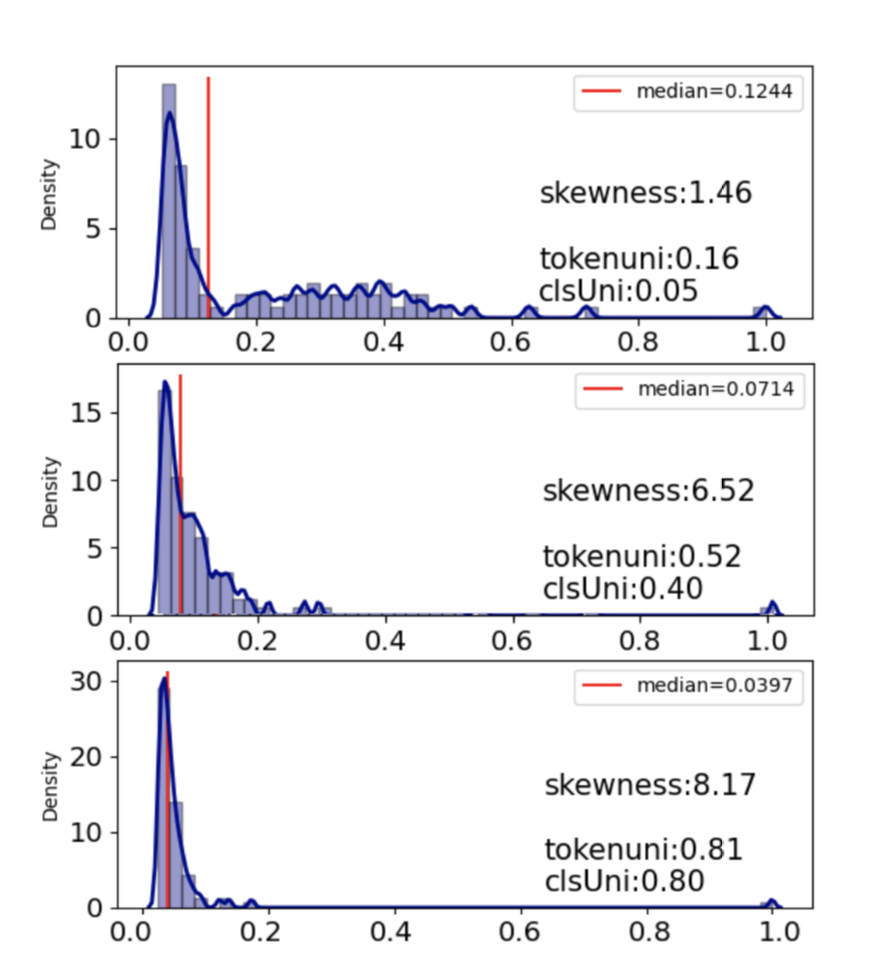

# Addressing Token Uniformity in Transformers via Singular Value Transformation
UAI2022: Addressing Token Uniformity in Transformers via Singular Value Transformation 

[Hanqi Yan](https://warwick.ac.uk/fac/sci/dcs/people/u2048587/), [Lin Gui](https://warwick.ac.uk/fac/sci/dcs/people/lin_gui/), [Wenjie Li](https://www4.comp.polyu.edu.hk/~cswjli/), [Yulan He](https://warwick.ac.uk/fac/sci/dcs/people/yulan_he/).

## Motivations
In this work, we characterise the token uniformity problem (See in the Figure below) commonly observed in the output of transformer-based architectures by the degree of skewness in singular value distributions and propose a singular value transformation function (SoftDecay) to address the problem.
<p align="center">

</p>
<h5> Singular value distribution of the outputs from
BERT layer 0, 7 and 12 (from top to bottom) in the GLUE-
MRPC dataset. The skewness, token uniformity and [CLS] uniformity values increase as BERT
layer goes deeper, while the median of singular values decreases drastically, close to vanishing. 
</h5>

## Requirements

Our project is based on Huggingface Transformers, so basically you can refer the requirements from [their repository](https://github.com/huggingface/transformers). 

## Code Structure

1. Main Functions

Our method is evaluated on text-classification tasks (GLUE Datasets), so we define the main functions in [run_glue_no_trainer.py](/examples/pytorch/text-classification). It should be noted that if you have already downloaded the official Transformer packgae, you may need to specify the [directory](/src/) for our updated version.

```python
# involve our updated SoftDecay Transofmer Directory /tokenUni/src/

sys.path.insert(0,"/YourDir/tokenUni/src/")
```

2. Pretrained Language Models + SoftDecay

Our SoftDecay Transofmer code is in [this repo](/tokenUni/src/transformers/models/), including the AlBERT, BERT, DistilBERT, Roberta. Take BERT as an example, we modify the configuration file [configuration_bert.py](/tokenUni/src/transformers/models/bert/configuration_bert.py) and the modeling_bert.py[/tokenUni/src/transformers/models/bert/modeling_bert.py] to insert the SoftDecay function. And the SoftDecay function is defined in [soft_decay.py](tokenUni/src/transformers/models/soft_expand.py)

3. Visualization

This code [vis_tool0502.py](tokenUni/src/transformers/models/vis_tools_0502.py) is used to visualize the singular value distributions, i.e., the CDF and histgrams, as well as calculate the representation metrics.


## Demo of Unsupervised Evaluation on STS datasets

Since SoftDecay is directly applied on output representation, and we can fix the function parameter $\alpha$ to define a decay function and get the transorformed representations for evaluation without training. (In supervised setting, $\alpha$ is trained under the task supervision to get better downstream task results.)

```python
python .py
```

## Citation

If you find our work useful, please cite as:

```
@inproceedings{
yan2022addressing,
title={Addressing Token Uniformity in Transformers via Singular Value Transformation},
author={Hanqi Yan and Lin Gui and Wenjie Li and Yulan He},
booktitle={The 38th Conference on Uncertainty in Artificial Intelligence},
year={2022},
url={https://openreview.net/forum?id=BtUxE_8i5l5}
}
```
